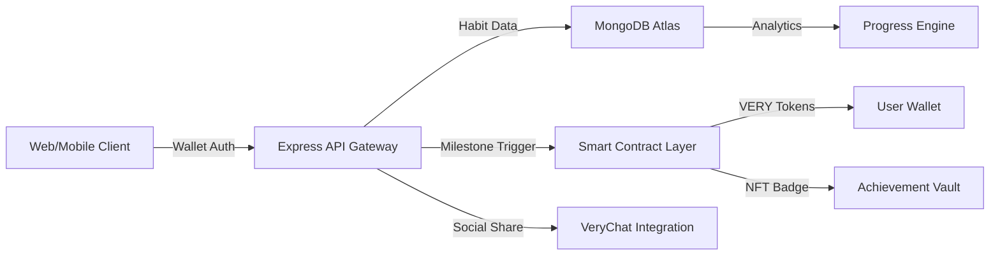
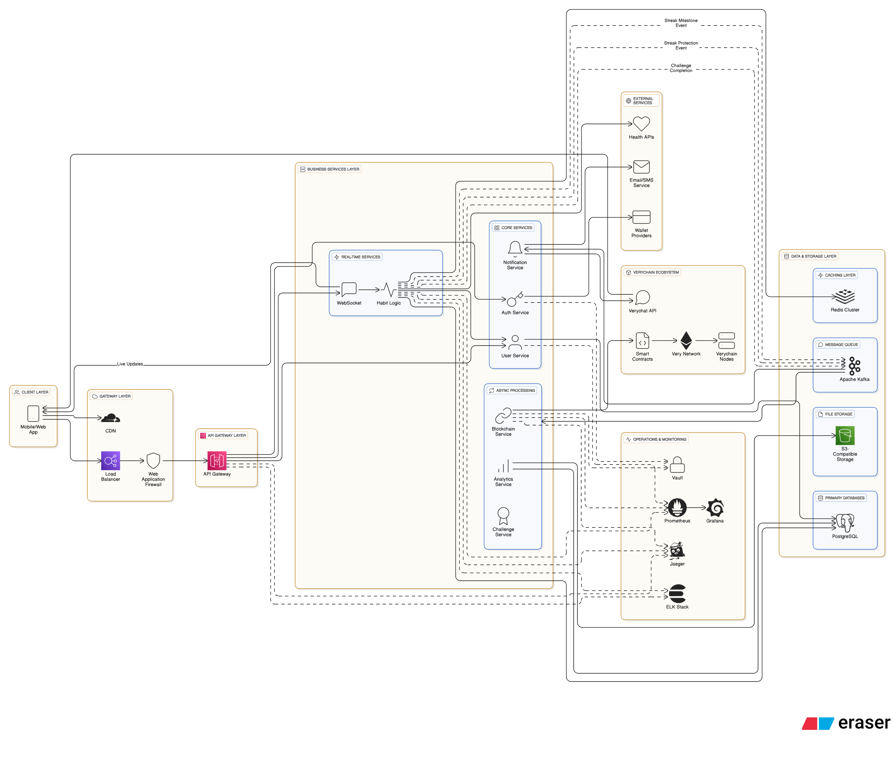
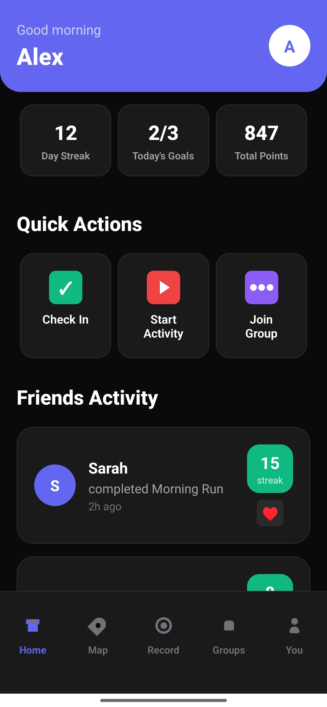
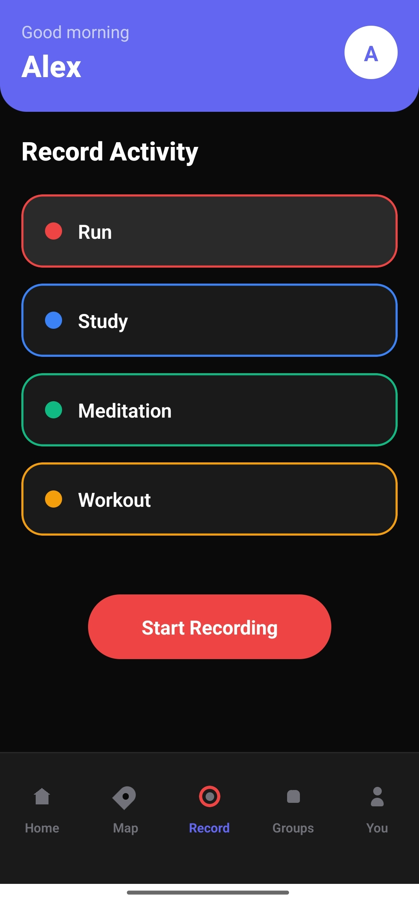
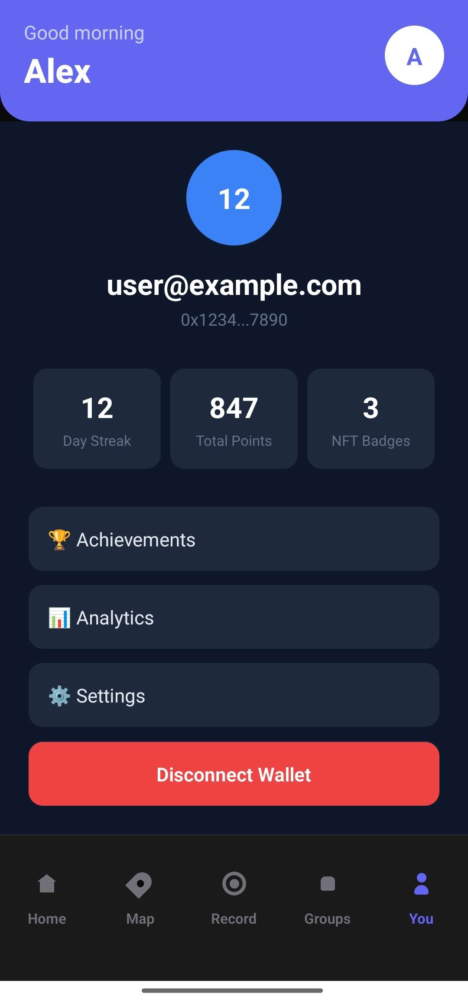
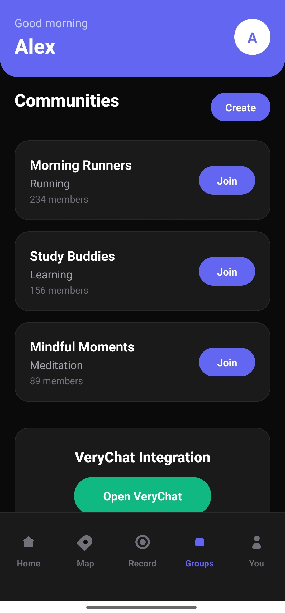

```
╔══════════════════════════════════════════════════════════════════════════════╗
║                          ⚡ CONSTRIX PROTOCOL ⚡                            ║
║                     THE HABIT LAYER FOR WEB3                                ║
╚══════════════════════════════════════════════════════════════════════════════╝
```

🌐 **[WEB DASHBOARD](https://frontend-puce-eta-80.vercel.app/)** • 📱 **[MOBILE APP](https://frontend-puce-eta-80.vercel.app/mobile)** • 🎥 **[DEMO VIDEO](#)** • 📚 **[TECH DOCS](https://sandeep-2.gitbook.io/sandeep-docs)**

</div>


<div align="center">

# ⚡ C O N S T R I X ⚡
## 『 TRANSFORM HABITS INTO ON-CHAIN ACHIEVEMENTS 』


```
┌─────────────────────────────────────────────────────────────────┐
│  IMMUTABLE STREAK RECORDS • PORTABLE REPUTATION • VERY REWARDS  │
│  > Habit Verification Protocol ...................... [ACTIVE]  │
│  > Milestone Achievement System ..................... [ONLINE]  │
│  > Blockchain Settlement Layer ...................... [SYNCED]  │
└─────────────────────────────────────────────────────────────────┘
```

### ⟨ CONSISTENCY MEETS BLOCKCHAIN ⟩
*Transform daily habits into verifiable on-chain achievements while earning VERY tokens*

</div>


## 🎯 THE CONSTRIX PROTOCOL

**Constrix** is a next-generation habit-tracking protocol that bridges the gap between traditional productivity apps and Web3 achievement systems. We've engineered a social, gamified experience that makes consistency portable, verifiable, and rewarding.

> **⚠️ PROBLEM ANALYSIS**:  
> **[THREAT]** Habit apps lack accountability. Progress gets lost when switching platforms. No real incentives for consistency.  
> **[SOLUTION]** Immutable streak records on blockchain with portable reputation through soulbound NFTs and VERY token rewards.

### 🏆 CURRENT DEPLOYMENT STATUS

```
┌──────────────────────────────────────────────────────────────┐
│                                                              │
│  ✅ FRONTEND → Professional UI with wallet integration       │
│  ✅ BACKEND → Robust API with MongoDB and JWT auth          │
│  ✅ STREAKS → Complete tracking and milestone detection      │
│  ✅ CONTRACTS → Smart contracts deployed on Verychain       │
│  ✅ SOCIAL → VeryChat integration for community features     │
│  ✅ MOBILE → React Native foundation with Wepin SDK         │
│  🚧 BLOCKCHAIN → Integration layer (contracts → frontend)    │
│                                                              │
└──────────────────────────────────────────────────────────────┘
```


## 💡 OPERATIONAL FRAMEWORK

Constrix deploys cutting-edge **habit verification protocols** to transform daily routines into competitive achievement systems with precision milestone tracking.

### 🎮 CORE HABIT LOOP

```
┌──────────────────────────────────────────────────────────────┐
│                                                              │
│  📝 CREATE → ✅ CHECKIN → 🔥 STREAK → 🏆 MILESTONE          │
│                                                              │
│  [PHASE 1] Habit Creation Protocol                          │
│  [PHASE 2] Daily Verification System                        │
│  [PHASE 3] Streak Calculation Engine                        │
│  [PHASE 4] Milestone Achievement & Rewards                  │
│                                                              │
└──────────────────────────────────────────────────────────────┘
```

**[PHASE 1] HABIT CREATION**  
Deploy personalized habit protocols (Study/Fitness) with customizable parameters and verification requirements.

**[PHASE 2] DAILY VERIFICATION**  
Execute daily check-in sequences with timestamp verification and streak validation algorithms.

**[PHASE 3] STREAK CALCULATION**  
Maintain immutable streak records with precise calculation engines and milestone detection systems.

**[PHASE 4] MILESTONE REWARDS**  
Trigger achievement protocols at 7, 14, 30, 60, 100, 365-day milestones with VERY token distribution and NFT badge minting.

## 🏗️ SYSTEM ARCHITECTURE

```
┌─────────────────────────────────────────────────────────────────┐
│                                                                 │
│  Frontend (Next.js) → Backend (Node.js) → MongoDB → Verychain   │
│       ↓                    ↓                 ↓         ↓        │
│  Wallet Connect      JWT + Signatures    Habit Data  Smart      │
│  MetaMask/Wepin     Streak Calculation   Analytics   Contracts  │
│       ↓                    ↓                 ↓         ↓        │
│  Mobile App (React Native) ←────────────────────────────┘        │
│                                                                 │
└─────────────────────────────────────────────────────────────────┘
```


## 🛠️ SYSTEM COMPONENTS

### HYBRID ARCHITECTURE: PERFORMANCE + SECURITY

**⚡ OFF-CHAIN HABIT LAYER** (Performance-Optimized)
- **Next.js 14 Neural Core**: TypeScript with sub-200ms response times
- **MongoDB Atlas**: Distributed habit data with 99.9% uptime
- **Express API Gateway**: RESTful endpoints with JWT authentication
- **Real-time Analytics**: Live progress tracking and heatmap generation

**🔒 ON-CHAIN ACHIEVEMENT LAYER** (Security-Hardened)
- **Verychain Network**: High-throughput blockchain for milestone verification
- **Smart Contract Vault**: Secure VERY token distribution and NFT minting
- **Soulbound NFTs**: Non-transferable achievement badges
- **Merkle Proof System**: Gas-efficient batch reward distribution

### TECHNOLOGY MATRIX

| Layer | Technology | Purpose | Status |
|-------|------------|---------|--------|
| **Frontend** | Next.js 14 + TypeScript | User interface & wallet integration | ✅ DEPLOYED |
| **Styling** | Tailwind CSS + Animations | Professional UI with celebrations | ✅ ACTIVE |
| **Web3** | ethers.js + Wepin | MetaMask & mobile wallet support | ✅ INTEGRATED |
| **Backend** | Node.js + Express | API gateway & business logic | ✅ OPERATIONAL |
| **Database** | MongoDB + Mongoose | Habit data & user analytics | ✅ SYNCED |
| **Auth** | JWT + Wallet Signatures | Secure authentication layer | ✅ VERIFIED |
| **Blockchain** | Verychain + Solidity | Smart contracts & token rewards | 🚧 INTEGRATING |
| **Mobile** | React Native + Expo | Cross-platform mobile access | ✅ FOUNDATION |
| **Social** | VeryChat Integration | Community features & sharing | ✅ Planning|

### DATA FLOW ARCHITECTURE



## 📁 PROTOCOL STRUCTURE

```
constrix/
├── frontend/                 # Next.js command center
│   ├── src/
│   │   ├── app/             # Dashboard, habits, social pages
│   │   ├── components/      # UI components & wallet integration
│   │   ├── context/         # React state management
│   │   ├── hooks/           # Custom hooks (useApi, useAuth)
│   │   ├── lib/            # Web3 utilities & blockchain
│   │   └── types/          # TypeScript definitions
│   ├── public/             # Static assets & animations
│   └── vercel.json         # Production deployment config
├── backend/                 # Node.js API fortress
│   ├── src/
│   │   ├── controllers/    # API route handlers
│   │   ├── models/         # MongoDB data schemas
│   │   ├── routes/         # Express route definitions
│   │   ├── services/       # Business logic & streak calculation
│   │   ├── middleware/     # Authentication & validation
│   │   └── database/       # Database connection layer
│   └── .env.production     # Production environment
├── contracts/              # Smart contract arsenal
│   ├── contracts/          # Solidity contract files
│   ├── scripts/           # Deployment automation
│   └── hardhat.config.js  # Blockchain configuration
├── constrix-mobile/        # React Native mobile terminal
│   ├── src/               # Mobile app components
│   ├── App.tsx            # Main application entry
│   └── app.json           # Expo configuration
├── shared/                 # Cross-platform utilities
├── docs/                  # Technical documentation
├── scripts/               # Development & deployment tools
└── .github/workflows/     # CI/CD automation pipeline
```

```
═══════════════════════════════════════════════════════════════════════════════
                        [DEPLOYMENT INITIALIZATION]
═══════════════════════════════════════════════════════════════════════════════
```


### ACCESS POINTS
- **🌐 Web Dashboard**: http://localhost:3000
- **🔌 API Gateway**: http://localhost:5000
- **📱 Mobile Interface**: Expo Go application
- **🏥 Health Check**: http://localhost:5000/api/health

```
═══════════════════════════════════════════════════════════════════════════════
                        [PROTOCOL CAPABILITIES]
═══════════════════════════════════════════════════════════════════════════════
```

## 🎯 OPERATIONAL FEATURES

### ✅ DEPLOYED SYSTEMS

```
┌──────────────────────────────────────────────────────────────┐
│                                                              │
│  🔐 WALLET AUTHENTICATION                                    │
│  > MetaMask integration ......................... [ACTIVE]  │
│  > Wepin mobile wallet support .................. [ACTIVE]  │
│  > Signature-based JWT authentication ........... [SECURE]  │
│                                                              │
│  📝 HABIT MANAGEMENT PROTOCOL                                │
│  > Study habit tracking ......................... [ONLINE]  │
│  > Fitness routine monitoring ................... [ONLINE]  │
│  > Custom habit creation system ................. [READY]   │
│                                                              │
│  🔥 STREAK CALCULATION ENGINE                                │
│  > Real-time streak computation ................. [ACTIVE]  │
│  > Milestone detection algorithms ............... [ACTIVE]  │
│  > Progress analytics and heatmaps .............. [VISUAL]  │
│                                                              │
│  🏆 ACHIEVEMENT SYSTEM                                       │
│  > 7/14/30/60/100/365-day milestones ........... [ACTIVE]  │
│  > Celebration animations and modals ............ [LIVE]    │
│  > Social sharing via VeryChat .................. [SOCIAL]  │
│                                                              │
│  📱 CROSS-PLATFORM ACCESS                                   │
│  > Professional web interface ................... [LIVE]    │
│  > React Native mobile foundation ............... [READY]   │
│  > Responsive design with animations ............ [SMOOTH]  │
│                                                              │
└──────────────────────────────────────────────────────────────┘
```

### 🚧 INTEGRATION LAYER (In Progress)

```
┌──────────────────────────────────────────────────────────────┐
│                                                              │
│  ⛓️ BLOCKCHAIN SETTLEMENT                                     │
│  > Smart contracts deployed ..................... [READY]   │
│  > Frontend integration layer ................... [85%]     │
│  > Milestone verification on-chain .............. [TESTING] │
│                                                              │
│  💰 VERY TOKEN ECONOMY                                       │
│  > Reward distribution system ................... [CODED]   │
│  > Milestone-based token allocation ............. [READY]   │
│  > Staking mechanisms for multipliers ........... [PLANNED] │
│                                                              │
│  🏅 NFT ACHIEVEMENT BADGES                                   │
│  > Soulbound NFT contracts ...................... [READY]   │
│  > Achievement metadata system .................. [CODED]   │
│  > Badge visualization interface ................ [DESIGN]  │
│                                                              │
└──────────────────────────────────────────────────────────────┘
```

### 🔮 FUTURE PROTOCOL EXPANSIONS

- **🤝 Group Challenges**: Social habit competitions and team streaks
- **👨🏫 Coaching Marketplace**: Habit mentorship and guidance platform
- **🛡️ Insurance Pools**: Peer-to-peer streak protection mechanisms
- **🔄 Cross-Platform Sync**: Seamless web ↔ mobile synchronization
- **🎮 Gamification Layer**: Advanced achievement systems and leaderboards


### PRODUCTION ACCESS POINTS

```
┌─────────────────────────────────────────────────────────────────┐
│                                                                 │
│  🌐 FRONTEND INTERFACE                                          │
│  > Production URL ........... https://frontend-puce-eta-80.vercel.app │
│  > Status ................... [OPERATIONAL]                    │                        │
│  ⛓️ SMART CONTRACTS                                             │
│  > Network .................. Verychain Mainnet                │
│  > Status ................... [DEPLOYED]                       │
│                                                                 │
└─────────────────────────────────────────────────────────────────┘
```

### DEPLOYMENT VERIFICATION

```bash
# Health check endpoints
curl https://constrix-backend.railway.app/api/health
curl https://constrix.vercel.app/api/status

# Expected response: {"status": "operational", "timestamp": "..."}
```


## ⚡ VERY ECOSYSTEM INTEGRATION

Constrix isn't just deployed *on* Very Network—it's architected to showcase its capabilities through deep protocol integration.

### 🏃‍♂️ Real-World Utility Matrix
Transform daily habits into quantifiable blockchain value. Unlike abstract DeFi protocols or purely virtual NFT collections, Constrix generates tangible utility from consistent human behavior.

### 💬 VeryChat Neural Link
Real-time social intelligence transmitted directly to **VeryChat** communication channels:
- **Achievement Alerts**: Instant notifications when milestones are reached
- **Community Support**: Connect with habit accountability partners
- **Social Proof**: Share verified streak achievements with cryptographic proof

### VERY TOKEN ECONOMY

The **VERY token** powers all economic transactions:
- **Milestone Rewards**: Earn tokens for 7, 14, 30, 60, 100, 365-day streaks
- **Staking Multipliers**: Lock tokens for enhanced earning rates
- **NFT Badge Minting**: Use tokens to mint soulbound achievement NFTs

## DELIVERABLES

### ✅ COMPLETED SYSTEMS
- **Full-stack Web3 Application**: Complete frontend, backend, and smart contracts
- **Professional User Interface**: Modern design with animations and celebrations
- **Wallet Integration**: MetaMask + Wepin support for web and mobile
- **Complete Backend API**: RESTful endpoints with JWT authentication
- **Database Architecture**: MongoDB with optimized schemas
- **Smart Contract Suite**: Deployed on Verychain with reward mechanisms
- **Mobile App Foundation**: React Native with Wepin SDK integration
- **Production Deployment**: Automated deployment scripts and CI/CD
- **VeryChat Integration**: Social sharing and community features

### 🎯 DEMO READY FEATURES
- **User Registration**: Wallet-based authentication system
- **Habit Management**: Create, track, and manage daily habits
- **Streak Tracking**: Real-time calculation with milestone detection
- **Achievement System**: Celebration modals and progress visualization
- **Social Features**: Share achievements via VeryChat integration
- **Analytics Dashboard**: Progress heatmaps and detailed insights

## Architecture and Preview

### System Architecture

*Technical architecture and system design*

### Screenshots

<div align="center">

| Dashboard | Habit Management | Profile | Community |
|-----------|------------------|-------------|--------|
|  |  |  |  |
| *Main dashboard with habit tracking* | *Create Study/Fitness habits* | *Milestone celebrations* | *Social features and engagement* |

</div>

### Web

<div align="center">

| ||
|------------|-------------|
|  |  |

</div>


### OPERATIVE CHANNELS
- **🌐 Live Demo**: [frontend-puce-eta-80.vercel.app](https://frontend-puce-eta-80.vercel.app)
- **📚 Documentation**: [docs.constrix.app](https://sandeep-2.gitbook.io/sandeep-docs)
- **💬 VeryChat Community**: [Join habit accountability rooms](https://play.google.com/store/apps/details?id=com.add.verychat_app&hl=en-US&pli=1)
- **⚡ Very Network**: [Official ecosystem](https://wp.verylabs.io/verychain/introduce-verychain)
- **🔗 Smart Contract**: [View on VeryScan](https://www.veryscan.io/address/0xeF036a43bc832781Ba44F95f898d9e44d1F7fe1d?tab=txs)

```
═══════════════════════════════════════════════════════════════════════════════
                        [LICENSE & DEPLOYMENT]
═══════════════════════════════════════════════════════════════════════════════
```

## 📄 PROTOCOL LICENSE

This project operates under the **MIT License** - see the [LICENSE](LICENSE) file for complete terms.

<div align="center">

### ⚡ READY TO TRANSFORM HABITS INTO ON-CHAIN ACHIEVEMENTS? ⚡

```
┌─────────────────────────────────────────────────────────────────┐
│                                                                 │
│  JOIN THE CONSISTENCY REVOLUTION                                │
│  > Making habit tracking immutable and rewarding               │
│  > Making Web3 accessible through daily routines               │
│                                                                 │
└─────────────────────────────────────────────────────────────────┘
```

</div>